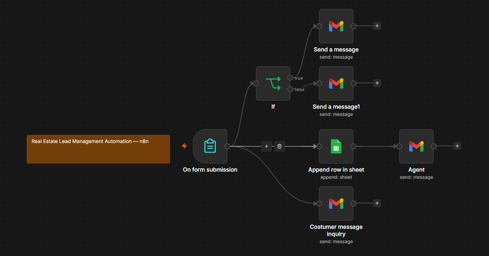

# Real Estate Lead Management Automation — n8n

## Overview

An automated lead management workflow built with n8n for a real estate business.

The system captures property inquiries, stores lead information, sends customer confirmation emails, notifies sales agents, and prioritizes leads based on their budget.

## Problem

Real estate inquiries can require manual processing. An assistant may need to review incoming inquiries, copy customer information into a spreadsheet, notify sales agents, and respond to customers.

This can lead to delayed responses and missed opportunities.

## Solution

I built an n8n workflow that automates the lead management process.

### Workflow

Form Submission
→ Google Sheets
→ Sales Agent Notification

Form Submission
→ Customer Confirmation

Form Submission
→ Budget Check
→ High Priority / Normal Priority Notification

## Features

- Automated lead capture
- Google Sheets integration
- Automated customer confirmation
- Sales agent notification
- Budget-based lead prioritization
- Conditional workflow routing
- Gmail integration

## Tools Used

- n8n
- Google Sheets
- Gmail
- Form Trigger
- IF / Conditional Logic

## My Role

**Automation Developer | Personal Project**

## Project Status

**Completed**

## Portfolio Note

This repository contains a sanitized portfolio version of the workflow. Credentials and private account information have been removed.
